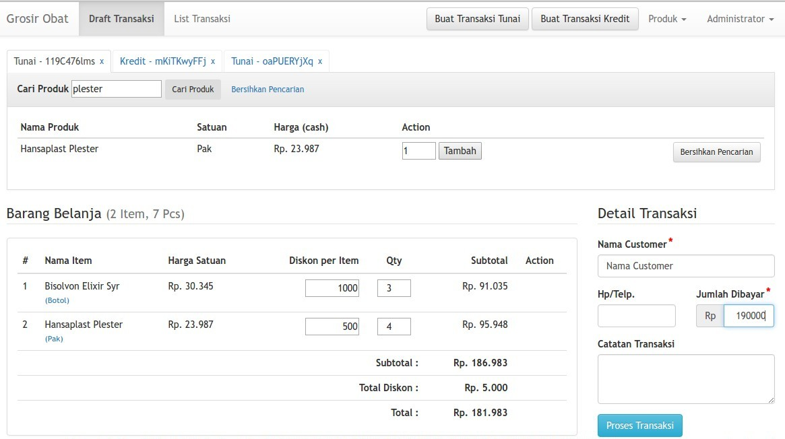
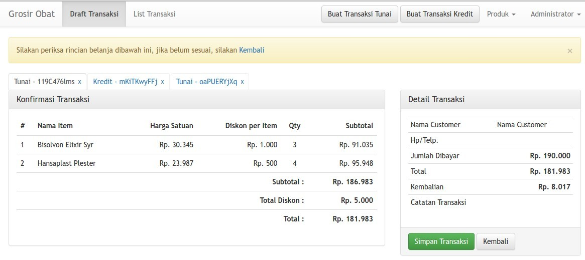
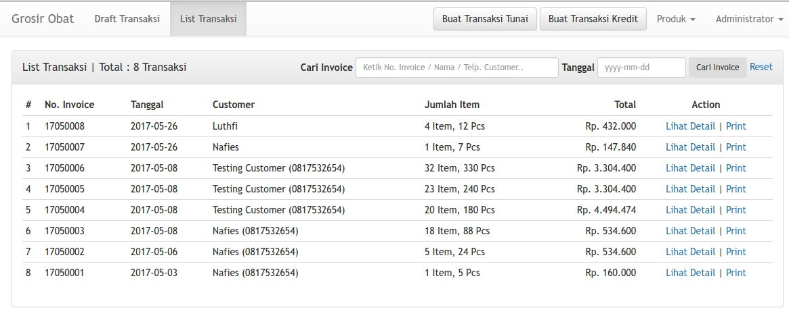
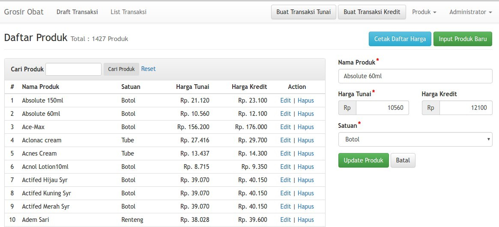
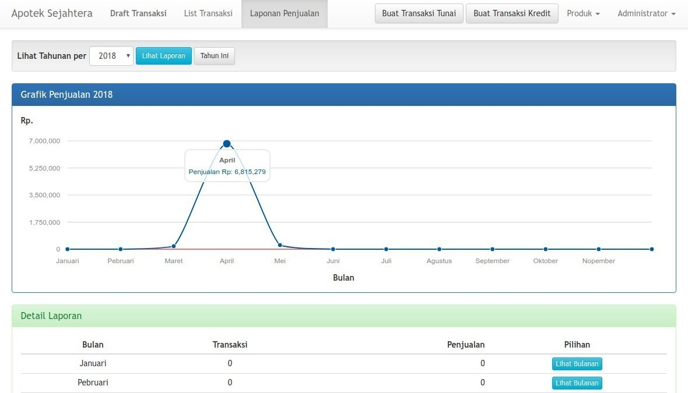
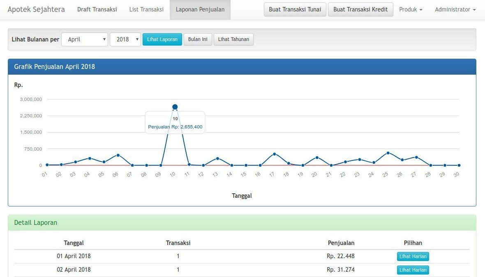

<!--  -->

<!-- [](https://travis-ci.org/nafiesl/grosir-obat)
[](https://styleci.io/repos/87638082) -->


<!-- Garis Lurus -->
 
<!-- End -->

<h1 align="center">Aplikasi Toko Obat</h1>
<!-- Garis Lurus -->
 
<!-- End -->

Aplikasi Toko Obat adalah sebuah sistem kasir (Point of Sales) dan manajemen produk obat yang dibuat menggunakan framework Laravel, dibangun dengan Test-Driven Development.

<!-- Garis Lurus -->
 
<!-- End -->

## Siapa pembuat aplikasi ini?

| Profile        |  Keterangan                      |
|----------------|----------------------------------|
| Nama           | Bagus Budi Satoto                |
| Jurusan        | S1 - Informatika                 |
| Kampus         | Universitas Amikom Yogyakarta    |


<hr>

<!-- Garis Lurus -->
 
<!-- End -->

## Fitur

Fitur pada Aplikasi ini meliputi:

1. Akun Login
    - Login dan Logout User
    - Ganti Password User
2. Entry Transaksi
    - Entry Transaksi Tunai
    - Entry Transaksi Kredit
    - Pencarian Produk
    - Konfirmasi Transaksi
    - Cetak Nota (PDF; Format A4)
3. Manajemen Produk
    - List Produk
    - Cetak Daftar Harga
    - Input Produk Baru
    - Edit Produk (Harga Tunai dan Kredit)
    - Hapus Produk
4. Manajemen Satuan Produk
    - List Satuan Produk
    - Input Produk Baru
    - Edit Satuan Produk
    - Hapus Satuan Produk
5. Manajemen Transaksi
    - List Transaksi Hari ini
    - List Transaksi
    - Detail Transaksi
    - Cetak Nota (PDF; Format A4)
6. Laporan Penjualan
    - Penjualan Per Tahun
    - Penjualan Per Bulan
    - Penjualan Per Tanggal
6. Manajemen User
    - List User
    - Input User Baru
    - Edit User
    - Hapus User (jika tidak ada transaksi)

Catatan:
- **Transaksi Kredit** saat ini hanya ditujukan untuk membedakan harga produk, bukan input pembayaran yang diangsur oleh customer. Dipersilakan jika ada yang berkenan mengembangkan fitur tersebut.

<hr>

<!-- Garis Lurus -->
 
<!-- End -->

## Instalasi

### Spesifikasi
- PHP version 7.2
- Laravel 6.x
- Database MySQL atau MariaDB
- SQlite (untuk `automated testing`)

### Cara Install

1. Clone atau download source code
    - Para terminal, clone repo `git clone git@github.com:bagussatoto/Toko-Obat-App.git`
    - atau `git clone https://github.com/bagussatoto/Toko-Obat-App`
    - Jika tidak menggunakan Git, silakan **Download Zip** dan *extract* pada direktori web server (misal: xampp/htdocs)
2. `cd obat-app`
3. `composer install`
    - Jika tidak menggunakan Git, bisa rename file `.env.example` menjadi `.env`
4. Pada terminal `php artisan key:generate`
5. Buat **database pada mysql** untuk aplikasi ini
6. **Setting database** pada file `.env`
7. Masukkan **Nama Aplikasi**, **Nama Toko**, **Alamat Toko** dan **Telp Toko** pada pada file `.env`
    ```
    APP_NAME="Toko Obat"
    STORE_NAME="Toko Obat"
    STORE_ADDRESS="Jln. Pramuka, No. 99, Daerah Istimewah Yogyakarta"
    
    ```
8. `php artisan migrate --seed`
9. `php artisan serve`
10. Selesai

<!-- Garis Lurus -->
 
<!-- End -->

## Login Admin
```
Username: admin
Password: secret
```

## Automated Testing
Aplikasi ini dilengkapi dengan **Testing Laravel**, ingin mencoba? Silakan:
```
vendor/bin/phpunit
```
<hr>

<!-- Garis Lurus -->
 
<!-- End -->

## Input Produk dan Satuan
Untuk mulai menggunakan aplikasi, silakan inputkan **Satuan Produk** terlebih dahulu, misal:
`Box, Botol, Kaleng, Keping, Pak, Pcs`

Kemudian inputkan **Produk** agar dapat dimasukkan ke dalam transaksi belanja (Cart)

<hr>

<!-- Garis Lurus -->
 
<!-- End -->

## Proses Transksi

### Keranjang Belanja

**Keranjang Belanja** didesain agar mengikuti hirarki berikut:
- Kelas **CartCollection** memiliki beberapa kelas **CashDraft** dan atau **CreditDraft**
- Kelas **CashDraft** memiliki beberapa **Item** dengan harga **Tunai**
- Kelas **CreditDraft** memiliki beberapa **Item** dengan harga **Kredit**
- Kelas **CashDraft** akan disimpan sebagai transaksi dengan model **Transaction** tipe **Tunai**
- Kelas **CreditDraft** akan disimpan sebagai transaksi dengan model **Transaction** tipe **Kredit**

### Proses Entry Transaksi

Proses Entry transaksi baru:

1. User login
2. Klik tombol **Transaksi Tunai** (atau **Transaksi Kredit**)
3. Cari produk (minimal 3 huruf)
4. Muncul list produk dengan harga sesuai jenis transaksi
5. Isi **Jumlah Item**, klik **Tambah**
6. Item produk yang bersangkutan akan muncul pada List Item
7. Isi data pembeli
8. Klik **Proses Transaksi**
9. Muncul halaman **Konfirmasi Transaksi** (cek list item, harga dan total)
10. Klik **Simpan Transaksi**
11. Muncul halaman **Detail Transaksi**
12. **Cetak Nota** format PDF ukuran A4.

<hr>

<!-- Garis Lurus -->
 
<!-- End -->

## Screenshots

#### Shopping Cart


#### Konfirmasi Entry Transaksi


#### List Transaksi


#### Daftar Produk


#### Laporan Penjualan Pertahun


#### Laporan Penjualan Perbulan


<!-- Garis Lurus -->
 
<!-- End -->

## Contac Person

|  Email    |                 
|-----------|
| bagusbudi1308@gmail.com |

| WhatsApps |
|-------|
| 08988325547 |


<!-- Garis Lurus -->
 
<!-- End -->

## Request Fitur Baru dan Pelaporan Bug

Anda dapat meminta fitur baru maupun melaporkan bug melalui menu **issues** yang sudah disediakan oleh GitHub (lihat menu di atas), posting issues baru dan kita akan berdiskusi disana.

<!-- Garis Lurus -->
 
<!-- End -->

## Berkontribusi

Siapapun dapat berkontribusi pada proyek ini mulai dari pemrograman, pembuakan buku manual, sampai dengan mengenalkan produk ini kepada mahasiswa 
untuk belajar agar mengurangi kesenjangan pendidikan teknologi dengan cara membuat postingan issue di repository ini.

<!-- Garis Lurus -->
 
<!-- End -->


